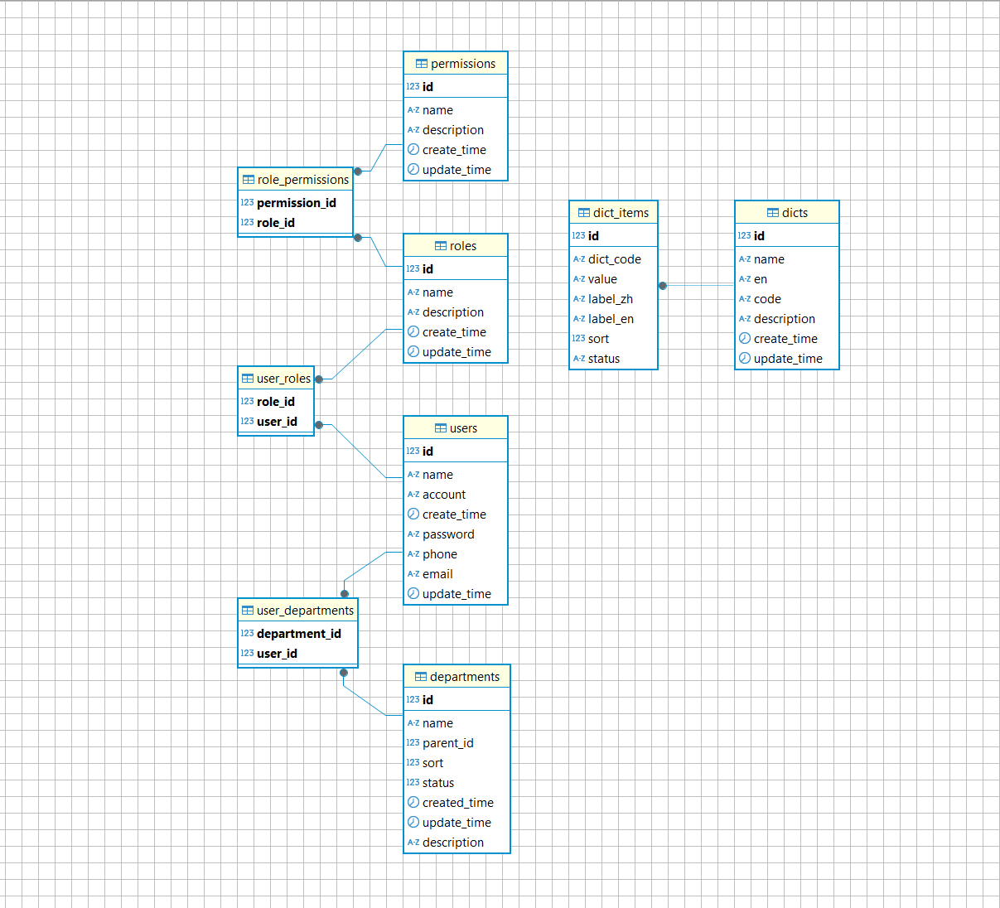

## 🚀 Go 微服务框架模板（Gin + GRPC + Consul + Gorm + dig）

这是一个现代化、高可维护性的 Go 微服务架构模板，基于 Gin、gRPC、GORM、Consul，并通过 [dig](https://github.com/uber-go/dig) 实现依赖注入，提升模块解耦与测试友好性，支持 HTTP 与 gRPC 双协议访问。

***

## 🧱 项目结构概览

    internal/
    ├── common/                # 公共工具与通用逻辑（如错误、日志）
    │   └── logger/
    │   └── jwt/
    │   └── error/
    ├── config/                # 配置文件加载（支持多环境）
    ├── di/                    # 🚀依赖注入容器封装（基于 dig）
    │   └── container.go
    ├── dto/                   # DTO 数据结构
    │   └── config.go
    │   └── logger.go
    │   └── login.go
    │   └── result.go
    ├── grpc/
    │   ├── client/            # gRPC 客户端封装
    │   ├── container/         # gRPC 客户端依赖注入
    │   ├── handler/           # gRPC 逻辑实现
    │   ├── proto/             # proto 文件与生成代码
    │   ├── register.go        # gRPC 注册器
    │   └── server.go          # gRPC 启动器
    ├── handler/               # Gin 控制器（HTTP handler）
    ├── middleware/            # 中间件（日志、认证等）
    ├── model/                 # 数据模型定义（GORM）
    ├── repo/                  # 持久层（封装数据库访问）
    ├── router/                # Gin 路由注册
    ├── service/               # 业务逻辑层
    ├── utils/                 # 工具方法
    │   └── grpc_factory.go

***

## 💡 技术栈与特点

| 组件     | 说明                           |
| ------ | ---------------------------- |
| Gin    | 快速的 HTTP 路由框架                |
| gRPC   | 高性能服务间通信协议，支持 proto 代码生成     |
| Consul | 服务注册与发现，gRPC 服务自动注册          |
| GORM   | Golang ORM 框架，用于操作 MySQL 数据库 |
| dig    | 🧩 Uber 出品的依赖注入容器，减少硬编码依赖    |
| zap    | 高性能结构化日志框架                   |

***

## 🚀 启动方式

#### 1. 安装依赖：

`go mod tidy`

#### 2.	启动服务：

`go run main.go`

*   默认监听端口：
*   HTTP: <http://localhost:8888>
*   gRPC: localhost:50051

⸻

#### 🧬 核心架构说明

🔗 依赖注入（dig 容器）

#### 容器初始化在：

`internal/di/container.go`

#### 注入了以下依赖：

*   日志（log.NewProvideLogger）
*   配置加载（config.ProvideConfig）
*   数据库连接（repo.ProvideDB）
*   业务服务（如 service.ProvideUserService）
*   控制器（handler.ProviderUserHandler）
*   gRPC 客户端（grpc/container.NewProvideClients）

#### 使用方式：

```go
container := di.NewContainer()

// 调用 handler 中的依赖
container.Invoke(func(h *handler.UserHandler) {
    // 使用 handler
})
```

#### ☁️ 配置系统

*   配置文件位于 /config/config.{env}.yaml
*   支持多环境切换：通过 APP\_ENV=dev、APP\_ENV=prod 控制
*   使用 viper 自动读取并注入依赖

#### 🧰 数据访问层

*   封装于 repo.Repo
*   注入为 \*gorm.DB 或自定义结构体
*   自动迁移模型结构（如 User）

#### ⚙️ gRPC 模块

*   grpc/client/: 客户端封装
*   grpc/handler/: 具体服务逻辑实现
*   grpc/proto/: proto 文件与自动生成代码
*   grpc/server.go: gRPC 启动入口

#### 启动后将自动注册至 Consul，并支持 grpcurl 调用。

⸻

#### 🧪 API 示例

REST 接口（HTTP）

GET 示例：

```bash
curl http://localhost:8888/user/test
```

返回：

```go
{
  "greeting": "你好, 用户!"
}
```

#### gRPC 接口

使用 grpcurl 测试：

```cgo
grpcurl -plaintext localhost:50051 app.HelloService.SayHello
```

⸻

#### ⚙️ 环境变量支持

    变量名	描述	示例值
    APP_ENV	运行环境	dev / prod
    SQL_URL	数据库连接字符串	user:pwd@tcp(…)

⸻
#### 路由使用，传递 middleware.Jwt(false|true)来确定是否使用jwt认证
```cgo
// 登录
router.POST("/login", middleware.Jwt(false), userHandler.Login)
//注册
router.POST("/register", middleware.Jwt(false), userHandler.Register)
//获取列表
router.GET("/list", middleware.Jwt(true), userHandler.List)
//jwt认证测试
router.GET("/auth", middleware.Jwt(true), userHandler.TestAuth)
```

#### 📌 后续规划（TODO）

    •	⏳ 用户鉴权中间件（JWT）(已完成)
    •	⏳ Kafka 消息队列集成 (开发中..)
    •	⏳ 用户权限 (开发中..)
    •	⏳ 字典管理 (规划中..)
⸻

#### 权限表设计


⸻

📄 License

MIT License

⸻
